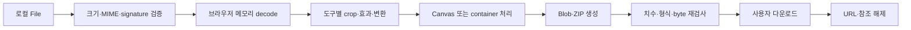

# 픽셀핏 아키텍처

기준일: 2026-07-30

## 1. 상태와 설계 경계

- **공개 v1:** 2026-07-22 배포된 기존 6개 도구 릴리스다.
- **공개 v2:** `pixelfit.me`에 총 13개 도구, 8개 가이드, 중앙 환경설정, Search Console URL-prefix meta와 분리된 AdSense 계정 확인/광고 게이트가 배포돼 있다.
- **P6 작업 트리 기록:** 입력 헤더 방어, 결과 재검증, Worker 범위, 접근성, 구조화 데이터 회귀 검사를 보강한 로컬 후보였다.
- **현재 P7 작업 트리:** 실제 운영자 identity, 사용자 중심 신뢰 페이지, 도구별 배지·핵심 정보·날짜, 자체 sample 22개와 압축 썸네일 4개, 모바일 탐색과 선택적 기기 공유를 보강한 로컬 후보이며 아직 commit·push·배포하지 않았다. Vitest 49 files·206/206, E2E 48 passed·2 intended skips, axe 4/4, 최종 `pnpm check`의 Pages/custom verifier 617/618 checks, `build:custom:test`와 마지막 custom build 618 checks를 확인했다. Lighthouse 13.0.1 `p7-final` 12개는 mobile Performance 98~99, desktop 100과 전부 A11y/Best Practices/SEO 100·CLS 0을 기록했다.
- **현재 인스타그램 프로필 사진 후보:** 공개 v2와 P7 기록 위에 새 `instagram-profile` workspace와 14번째 도구를 추가한 로컬 작업이며 아직 commit·push·배포하지 않았다.

이 문서는 현재 코드 구조를 설명한다. 공개 v2의 commit·GitHub Actions·Pages·실제 URL 증거와 아직 배포하지 않은 작업 트리 검증을 섞지 않는다. 실행 결과는 [STATUS.md](./STATUS.md), 출시 판정은 [RELEASE_CHECKLIST.md](./RELEASE_CHECKLIST.md)에 분리한다.

픽셀핏은 Next.js App Router, React, strict TypeScript와 Tailwind CSS로 만든 static export 앱이다. 이미지 업로드 API, 계정, 사용자 프로젝트 데이터베이스는 없다. 파일 디코드, Canvas 렌더, 형식 변환, ZIP 생성과 다운로드는 브라우저에서 수행한다.

## 2. 계층과 의존 방향

```text
src/app
  route, metadata, static page composition, JSON-LD
       ↓
src/components
  layout, content, ads, session transfer, shared workspaces
       ↓
src/features
  legacy tool adapters + eight additional tool workspaces
       ↓
src/config
  tools, guides, env, brand URLs, Organization identity, badges, samples, AdSense gates
src/lib
  presets, files, image math/encode/metadata, privacy helpers
       ↓
Browser APIs
  File, Blob, Canvas, createImageBitmap, URL, Worker
```

도구와 가이드 목록은 각각 `src/config/tools.ts`, `src/config/guides.ts`의 Zod 검증 Registry가 단일 탐색 기준이다. 배포 URL과 광고 여부는 `src/config/env.ts`, URL 조립은 `src/config/brand.ts`, 공통 구조화 identity는 `src/config/organization.ts`, 배지 문구는 `src/config/tool-badges.ts`, 자체 예시는 `src/config/samples.ts`, 허용 광고 위치는 `src/config/adsense.ts`가 담당한다.

순수 이미지·파일 모듈은 route와 React UI에 의존하지 않는다. 직접 dependency는 v1과 동일하며, v2를 위해 새 runtime·개발 package를 추가하지 않았다.

## 3. 정적 route 모델

빌드 시 생성하는 주요 경로는 다음과 같다.

- 홈 `/`
- 도구 Registry의 `/[tool]` 14개
- 가이드 인덱스 `/guide`
- 가이드 Registry의 `/guide/[slug]` 8개
- `/about`, `/privacy`, `/terms`, `/contact`
- `robots.txt`, `sitemap.xml`, 정적 404

사용자 파일을 받는 route handler, server action, serverless image function은 두지 않는다. 정상 이미지 작업은 클라이언트 경계 안에서 끝난다. static export의 HTML, CSS, JavaScript, 아이콘, OG PNG 같은 자체 자산 요청은 존재하며, 광고를 명시적으로 활성화하면 별도의 외부 광고/CMP 요청이 생길 수 있다.

## 4. Registry와 콘텐츠 모델

### 도구 Registry

각 도구는 최소한 다음을 가진다.

- 고유 `id`, `slug`, `workspaceKind`, 카테고리
- 제목, 짧은 설명, 표시 규격과 검색어
- `official` 또는 `convention` 출처 성격인 `sourceKind`
- 출처 성격과 분리된 `badgeKind`: `official-standard`, `official-reference`, `common-photo-size`, `utility`, `service-size`, `creator`, `creative`, `privacy`, `web`
- 도구 상단에 노출하는 도구별 `heroFacts` 정확히 2개
- 공식값이면 기관, 제목, URL, `lastVerifiedAt`
- 고유 SEO 제목·설명·1200×630 OG PNG·독립적인 `contentPublishedAt`과 `contentUpdatedAt`
- 제목과 설명을 각각 가진 고유 사용 사례, 출력 설명, 단계, 실수, 한계, 체크리스트, 예시
- 화면용 FAQ와 다음 도구 목록

공식 도구는 출처가 없으면 validation에 실패한다. 공식 출처가 없는 도구에는 공식 배지를 표시하지 않는다. 자기 자신을 다음 도구로 가리킬 수 없고 slug·연결 대상·OG 파일·가이드 연결은 테스트에서 검사한다. 게시일과 수정일은 전역 상수를 공유하지 않으며, `contentUpdatedAt`은 실제 콘텐츠 버전 날짜로서 출처 확인일이나 파일 촬영일을 대신하지 않는다. 두 날짜는 도구 화면, sitemap과 구조화 데이터에 같은 값으로 반영한다.

### 가이드 Registry

가이드는 고유 slug, 카테고리, 문제 정의, 검색어, 섹션, 조건 예시 표, 도구 CTA와 관련 가이드를 가진다. 공식 근거가 있는 글은 출처와 확인일을 함께 표시한다. 가이드의 계산·제품 해석은 [PRESET_SOURCES.md](./PRESET_SOURCES.md)와 동일한 경계를 유지한다.

### 자체 제작 sample Registry

`src/config/samples.ts`는 여권사진·이미지 압축·YouTube 썸네일·네컷사진·필름사진에 연결되는 자체 제작 본 sample 22개의 경로, 치수, 대체 텍스트와 설명을 선언한다. 본 예시는 압축 비교용 full PNG 4개와 SVG 18개다. 압축 갤러리는 각 full PNG에 대응하는 480×320 PNG 썸네일 4개를 별도 선언한다. `SampleGallery`는 외부 사진이나 사용자 업로드를 sample로 사용하지 않으며, 갤러리가 viewport에 들어오기 전에는 이미지를 렌더링하지 않는다. 진입 뒤 현재 route의 자산만 요청하고 압축 full PNG는 사용자가 원본 보기 링크를 눌렀을 때만 요청한다.

`scripts/generate-samples.mjs`는 도형·텍스트·추상 풍경으로 같은 입력에서 같은 SVG와 PNG를 만든다. 압축 full PNG 네 개의 actual bytes는 `1,045,528` / `279,843` / `110,060` / `34,154`이고, 100KB-downscaled fixture만 900×600이며 나머지 세 PNG는 1200×800이다. 이 값은 실제 파일 stat·manifest와 일치하지만 같은 사용자 원본에 압축 엔진을 실행한 결과라는 뜻은 아니다. UI는 색 단계·세부 묘사를 달리 만든 결정적 비교 fixture임을 명시한다. 썸네일 4개는 모두 480×320이다.

`pnpm generate:assets`는 본 sample 22개, 압축 썸네일 4개와 OG PNG 24개를 함께 생성하며 모든 production build의 선행 단계다. `pnpm verify:assets`는 sample digest `061e0431696e4a31`와 OG 생성 drift를 쓰기 없이 검사한다. Registry 테스트는 본 sample 22개와 썸네일 4개의 선언·물리 파일 집합 일치, 고아 파일 0개, 자체 제작 marker·대체 텍스트를 확인한다.

## 5. Workspace 구조

`workspaceKind`가 페이지에서 실제 편집기를 선택한다.

| kind | 담당 도구 | 구현 경계 |
| --- | --- | --- |
| `photo` | 여권, 일반 증명, 주민등록증, YouTube 배너 | 기존 `PhotoWorkspace`, 프리셋 정책과 크롭/출력 검사 |
| `favicon` | 파비콘 | 다중 PNG·ICO·manifest·ZIP 생성 |
| `privacy` | 개인정보 정리 | 형식별 메타데이터 parser와 결과 재검사 |
| `compressor` | 사진 용량 줄이기 | 목표 byte, 제한된 품질 탐색, 선택적 최대 4회 축소 |
| `resizer` | 이미지 크기 변경 | 치수·긴 변·퍼센트, 비율 잠금, contain/cover |
| `converter` | 형식 변환 | JPEG/PNG/WebP, 품질·배경·투명도 정책 |
| `instagram-profile` | 인스타그램 프로필 사진 | 1080×1080, 작은 원 안의 contain 배치, 원·테두리·캔버스 색과 위치 |
| `social-pack` | SNS 이미지 팩 | 1:1·4:5·9:16 독립 crop, 개별/ZIP 출력 |
| `youtube-thumbnail` | YouTube 썸네일 | 3840×2160 16:9 템플릿 |
| `four-cut` | 네컷사진 | 1~4개 파일, 반복 슬롯, 레이아웃·프레임·문구 |
| `film` | 필름사진 | 결정적 픽셀 효과와 원본 비교 |

공통 utility 도구는 `UtilityWorkspace`와 `useUtilityImage`, 창작 도구는 shared creative workspace와 `useCreativeImages`를 재사용한다. UI가 표시됐다는 사실만으로 기능 완료를 선언하지 않고 생성 Blob 또는 ZIP을 다시 읽어 도구 계약을 확인해야 한다.

## 6. 공통 이미지 파이프라인



확장자만 신뢰하지 않고 MIME과 signature를 조합한다. JPEG SOF, PNG IHDR, WebP VP8/VP8L/VP8X 헤더에서 실제 치수를 읽어 브라우저 디코드 전에 byte·한 변·픽셀 한도를 적용한다. 미리보기는 긴 변 1280px·120만 픽셀 이하로 제한하고 최종 출력 해상도와 분리한다. 크롭 좌표는 원본 기준으로 유지하고 늦게 도착한 분석 결과가 사용자의 편집을 덮지 않게 한다.

필름·네컷 톤·압축·리사이즈·형식 변환·SNS 비율 출력·3840×2160 썸네일은 지원 브라우저에서 `Worker`, `OffscreenCanvas`, `createImageBitmap`을 사용한다. 작업 완료·취소 시 bitmap과 Worker를 닫고, 지원하지 않는 환경에서는 같은 출력 계약을 가진 Canvas 폴백으로 전환한다. Worker와 폴백 결과 모두 Blob signature·MIME·치수를 메인 경계에서 다시 검사한다. 폴백의 긴 동기 픽셀 루프는 실행 도중 즉시 중단하지 못하고 전후에만 취소를 확인할 수 있다.

JPEG/WebP 품질 탐색은 종료 횟수가 제한된다. 목표를 만족하지 못하면 무한 반복하거나 가짜 성공을 표시하지 않는다. Canvas 인코더와 브라우저 색상 관리 때문에 원본 픽셀·ICC·메타데이터가 그대로 보존된다고 일반화하지 않는다.

## 7. 공식 도구 정책 게이트

프리셋 Registry는 출력 규격, 허용 작업, 금지 작업, 면책과 출처를 검증한다. UI에 버튼을 숨기는 것만으로 끝내지 않고 실행 경계에서 작업 allowlist를 다시 확인한다.

- 여권사진은 크롭·회전·리사이즈·제한적 압축만 허용하고 배경 제거·교체, retouch, 생성형 작업을 차단한다.
- 3×4cm와 3.5×4.5cm의 픽셀값은 `round(cm / 2.54 × 300)` 서비스 환산값이다. 기관이 명시한 온라인 픽셀값으로 과장하지 않는다.
- 얼굴 자동 맞춤은 선택적 네이티브 `FaceDetector`의 일시적 bbox만 사용한다. 미지원·0명·다중·실패 시 수동 경로를 제공하며 외부 모델로 대체하지 않는다.
- 배경 분리는 일반 증명사진의 명시적 경로에서만 로컬 결정적 색상 계산을 사용한다. 품질이 낮으면 원본 배경으로 돌아갈 수 있다.

## 8. 신규 도구의 계산 경계

- 압축기는 목표를 상한으로 취급하고 실제 `Blob.size`를 검사한다. 최소 품질 또는 축소 한계에서도 넘으면 미달을 알린다.
- 리사이저는 contain과 cover를 구분하고 원본보다 큰 출력에는 업스케일 경고를 표시한다.
- 변환기는 JPEG/PNG/WebP만 지원한다. 투명 입력을 JPEG로 만들 때 선택 배경에 합성하며 HEIC을 처리했다고 표시하지 않는다.
- SNS 팩은 출력 비율별 crop을 독립적으로 보존한다. 원형 미리보기는 표시 보조이며 파일 규격 자체가 원형 이미지라는 뜻은 아니다.
- 인스타그램 프로필 도구는 1080×1080 서비스 캔버스 안에 작은 원을 만들고 사진을 contain 배치한다. 미리보기와 렌더러는 같은 layout 계산을 사용하며 이 값을 Instagram 공식 의무 픽셀값으로 표시하지 않는다.
- YouTube 썸네일은 최신 공식 권장 3840×2160을 사용한다. 템플릿은 제한형 편집이며 YouTube 노출·CTR을 보장하지 않는다.
- 네컷사진은 입력이 4장보다 적으면 사용자가 고른 사진을 슬롯에 반복한다. 자동으로 새 인물이나 장면을 생성하지 않는다.
- 필름 효과는 동일 설정과 seed에서 재현 가능한 로컬 픽셀 계산이다. 생성형 AI, 원격 모델, 실제 필름 현상 재현 보장을 사용하지 않는다.

## 9. 같은 사진으로 다음 도구

사용자가 결과 화면에서 명시적으로 다음 도구를 선택할 때만 현재 `File`을 `ImageTransferProvider`에 넘긴다.

1. Provider는 `File` 하나를 React `useRef`에 보관한다.
2. 대상 도구 ID를 함께 기록한다.
3. 대상 편집기가 한 번 `claim`하면 참조를 제거한다.
4. 대상이 다르거나 다시 claim하면 전달하지 않는다.
5. 새로고침·탭 종료 시 브라우저 메모리와 함께 사라진다.

이 경로는 파일 복제나 업로드가 아니며 localStorage, sessionStorage, IndexedDB, Cache Storage를 사용하지 않는다. 사용자의 클릭 없이 자동으로 다른 도구에 파일을 전달하지 않는다.

네컷사진과 필름사진 결과에서는 브라우저가 Web Share API와 파일 공유를 제공하고 `navigator.canShare({ files })`가 참일 때만 선택적 공유 버튼을 표시한다. `canShare` 검사는 기능 가능 여부만 확인하며 파일을 전송하지 않는다. 실제 `navigator.share` 호출은 사용자가 현재 결과 화면의 버튼을 직접 누른 뒤에만 실행되고, 이후 대상 앱 선택과 전송은 운영체제 공유 화면의 경계다. 실패하거나 사용자가 취소하면 자동 재시도·외부 업로드 없이 다운로드 경로를 유지한다.

## 10. 중앙 환경설정과 URL

`parseEnvironment`는 URL, base path, 사용자 정의 도메인, 연락처, 운영자명, 광고 값, Google Search Console과 Naver 확인 토큰을 검증한다. 잘못된 선택값은 경고 후 사용하지 않으며, 핵심 URL과 custom hostname은 잘못되면 빌드를 실패시킨다.

- 기본 identity: `siteUrl=https://pixelfit.me`, `contactEmail=wodnd0823@gmail.com`, `operatorName=DUBEEUBBEE`
- GitHub Issues: 일반 문의 대체가 아닌 기능 오류 제보용 보조 채널
- project Pages: `siteUrl=https://dubeeubbee.github.io/pixelfit`, `basePath=/pixelfit`
- custom root: `CUSTOM_DOMAIN`의 HTTPS origin을 canonical로 사용하고 base path를 빈 값으로 강제
- 페이지 URL은 trailing slash를 통일하고 파일 URL은 확장자 뒤 slash를 붙이지 않음
- canonical, OG, sitemap, robots, 내부 링크와 JSON-LD가 같은 helper를 사용

custom root와 `/pixelfit`은 별도 빌드·검사 대상이다. GitHub Pages의 도메인 Settings, DNS, TLS와 Actions가 `CNAME`을 무시하는 동작은 코드 밖 운영 경계다.

## 11. 광고 게이트

AdSense 광고 제공은 기본 비활성이다. 다음 조건이 모두 참일 때만 전역 광고 스크립트와 슬롯을 렌더링한다.

1. `ADSENSE_ENABLED=true`
2. client가 `ca-pub-`와 16자리 숫자 형식
3. content slot이 10자리 숫자 형식
4. 위치가 `home-content-break`, `guide-content-break`, `tool-explainer-end` 중 하나

업로드, 편집, 미리보기, 결과, 다운로드, 내비게이션, privacy, terms, contact 표면은 금지한다. 설정이 꺼졌거나 불완전하면 광고 DOM과 네트워크 스크립트 모두 생성하지 않는다.

계정 확인 표면과 광고 제공은 별도다. 실제 형식의 publisher client가 있으면 광고 enabled/slot과 무관하게 `google-adsense-account` meta를 만들고, custom domain build에서는 루트 `ads.txt`를 만든다. 이 두 표면은 계정 연결을 도울 뿐 광고 요청, 사이트 승인 또는 동의 준수를 뜻하지 않는다. CMP, 계정·사이트 승인과 지역별 동의 정책은 외부 운영 작업이다.

기존 `pixelfit.o-r.kr`은 `o-r.kr` 아래 일반 하위 도메인이며 상위 `o-r.kr/ads.txt`도 이 프로젝트가 제어하지 못해 AdSense 사이트 등록 계약을 충족하지 못했다. 현재 `pixelfit.me`의 공개 root `ads.txt` 소유권 확인과 사이트 검토 요청은 완료됐지만 계정은 `준비 중`이다. CMP, 최종 승인과 광고 요청을 실제로 검증하기 전에는 광고 제공을 OFF로 유지한다.

## 12. SEO와 구조화 데이터

- 홈: `WebSite`, 일반 `WebApplication`
- About: 사이트 루트 URL·실제 이메일·한국어 ContactPoint를 가진 공통 `Organization`
- 가이드 허브: `ItemList`
- 도구: `BreadcrumbList`, `contentPublishedAt`/`contentUpdatedAt`을 `datePublished`/`dateModified`로 반영한 일반 `WebApplication`
- 가이드 상세: `BreadcrumbList`, 작성자 `DUBEEUBBEE` Person과 발행자 픽셀핏 Organization을 가진 `Article`
- 모든 주요 공유 이미지: 자체 생성 1200×630 PNG
- Google Search Console verification: 유효한 build-time token이 있을 때 URL-prefix HTML 확인 meta 생성
- Naver verification: 유효한 build-time token이 있을 때만 meta 생성

Organization 객체는 `src/config/organization.ts`에서 한 번 만들며 About과 가이드 publisher가 공유한다. About Organization URL은 About canonical이 아니라 mode별 사이트 루트다. 화면용 FAQ는 콘텐츠로 유지하지만 `FAQPage` JSON-LD는 생성하지 않는다. 일반 `WebApplication`에는 실제 화면과 일치하는 이름·URL·설명·이미지·게시·수정일만 넣는다. 실제 price, review 또는 rating 근거가 없으므로 Google 소프트웨어 앱 리치 결과를 위한 `offers`, `review`, `aggregateRating`이나 `SoftwareApplication` 표시는 만들지 않는다. 가짜 review, rating, 사용량, 존재하지 않는 작성·수정 날짜를 만들지 않는다.

## 13. 메타데이터·개인정보

개인정보 정리는 JPEG/PNG/WebP의 알려진 개인정보성 필드를 선택적으로 제거하고 결과를 다시 파싱한다. 지원 경로에서는 압축 픽셀 payload 보존을 우선하지만 알려지지 않은 vendor metadata나 콘텐츠 자격 증명 유효성까지 보장하지 않는다. C2PA/JUMBF/Content Credentials는 제거 선택지로 제공하지 않는다.

HEIC 디코더는 번들하지 않는다. HEIC 또는 미지원 container에 대해 가짜 결과·가짜 메타데이터·보존 성공을 만들지 않는다. 세부 데이터 생명주기와 광고 네트워크 경계는 [PRIVACY_MODEL.md](./PRIVACY_MODEL.md)를 따른다.

## 14. 빌드와 배포 경계

`next.config.ts`의 `output: "export"`로 `out/`을 만든다. `next start`나 이미지 처리 서버를 사용하지 않는다. `pnpm build`는 현재 공개 host인 `pixelfit.me` root 계약, `pnpm build:pages`는 `/pixelfit` 회귀 계약, `pnpm build:custom:test`는 test-only root-domain 계약을 빌드한다. 각 production build는 먼저 `generate:assets`로 본 sample 22개, 압축 썸네일 4개와 OG 24개를 결정적으로 다시 만든다.

`scripts/verify-static-export.mjs`는 route·canonical·OG URL·JSON-LD URL/이미지·asset·CNAME·검증 meta·광고 비활성 상태를 검사한다. P7에서는 About/Contact/가이드 HTML의 실제 운영자명과 이메일, 임시 이메일·`.example`·이전 운영자 문구 부재, About Organization과 가이드 author/publisher identity까지 검사한다. sample 계약은 `verify:assets`와 Registry/component 테스트가 선언 22개, 실제 파일 집합·고아 파일 0개, digest, 자체 제작 marker, 접근 가능한 대체 텍스트를 나누어 확인한다.

Next.js 16 기본 Turbopack은 현재 Worker 모듈 그래프에서 빌드가 끝나지 않아 release script는 `next build --webpack`을 사용한다. Webpack은 Worker runtime chunk 사이의 circular-dependency 경고를 출력하지만 정적 export와 브라우저 검사는 통과했다. 이는 제거되지 않은 알려진 build 경고이며 [STATUS.md](./STATUS.md)에 기록한다.

로컬 RC는 다음을 서로 독립적으로 확인한다.

- project Pages `/pixelfit` build 계약
- custom-domain root build 계약
- Registry의 14개 도구·8개 가이드 route
- 결정적으로 생성한 본 sample 22개(full PNG 4개·SVG 18개), 압축용 480×320 PNG 썸네일 4개·OG 24개와 선언 drift
- E2E, 개인정보 네트워크 검사, 접근성, Lighthouse

공개 release에는 여기에 실제 GitHub Actions, 공개 URL, 404·새로고침·MIME·응답 헤더 검증을 추가한다.

실행하지 않은 항목은 `NOT_TESTED`다. 현재 `pixelfit.me`의 DNS·TLS·Search Console·sitemap·AdSense `ads.txt` 확인은 외부 증거로 완료됐지만, AdSense 승인·CMP·광고 제공과 Naver 등록은 완료되지 않았다. 로컬 정적 export 성공을 현재 작업 트리의 공개 배포 완료로 확대하지 않는다.
