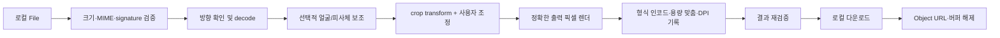

# 픽셀핏 v1 아키텍처

기준일: 2026-07-22

## 1. 결정 요약

픽셀핏은 Next.js App Router, React, strict TypeScript, Tailwind CSS로 만드는 정적 내보내기 애플리케이션이다. 서버 이미지 처리, 업로드 API, 계정, 데이터베이스는 없다. 브라우저가 로컬 파일을 디코드하고 Canvas 기반으로 렌더링하며 결과 Blob을 사용자의 기기에 다운로드한다.

핵심 설계 결정은 다음과 같다.

- 프리셋 Registry가 출력 규격, 출처, 허용 작업, 금지 작업, 검사와 면책의 단일 기준이다.
- React UI와 이미지 수학·바이너리 처리를 분리한다.
- 공식 사진의 작업 권한은 UI 표시 여부가 아니라 실행 경계에서 다시 검사한다.
- 얼굴 자동 맞춤은 지원 브라우저의 네이티브 `FaceDetector`를 선택적으로 사용하고, 모든 환경에서 수동 크롭을 기본 fallback으로 유지한다.
- 일반 증명사진 배경 분리는 서버나 외부 모델 없이 가장자리 표본과 색상 거리를 이용한 결정적(deterministic) 분할을 사용한다. 정확하지 않으면 원본 배경으로 복귀한다.
- 개인정보 정리는 형식별 컨테이너를 파싱해 가능한 경우 압축 픽셀 payload를 그대로 유지한다.
- 서버 기능이 없으므로 `next build`가 생성한 `out/`을 Vercel 또는 일반 정적 호스팅에 배포한다.

## 2. 계층과 의존 방향

```text
src/app                route, metadata, static page composition
        ↓
src/components         shared layout, upload/editor/result UI
        ↓
src/features           tool-specific orchestration and adapters
        ↓
src/lib/presets        validated policy and source registry
src/lib/image          pure geometry, rendering, encode, binary helpers
src/lib/files          signature, limits, filename, download helpers
src/lib/privacy        data-lifecycle and metadata policy
        ↓
Browser APIs           File, Blob, createImageBitmap, Canvas, URL, Worker
```

상위 계층은 하위 계층을 조합할 수 있지만 순수 이미지·바이너리 모듈은 React나 route에 의존하지 않는다. 도구별 화면은 공통 업로드·편집·결과 컴포넌트를 재사용하고 프리셋과 변형만 주입한다. 상태는 한 작업 흐름에 국한된 reducer/React state로 충분하므로 별도 전역 상태 라이브러리를 사용하지 않는다.

## 3. 정적 실행 모델

App Router 페이지는 빌드 시 정적으로 생성한다. 사용자 파일을 받는 route handler, server action, serverless function은 두지 않는다. 모든 이미지 기능은 클라이언트 경계 안에서 실행한다. 배포 시 필요한 네트워크 요청은 HTML, CSS, JavaScript와 같은 앱 자체 정적 자산뿐이며 외부 이미지 처리 서비스나 모델 CDN에 의존하지 않는다.

정적 export에서는 애플리케이션 코드가 응답 헤더를 동적으로 설정할 수 없으므로 CSP, Referrer-Policy, X-Content-Type-Options, Permissions-Policy, frame 제한은 호스팅 플랫폼 설정에서도 확인해야 한다. 정책 예시는 [개인정보 모델](./PRIVACY_MODEL.md)에 기록한다.

## 4. Preset Registry와 정책 게이트

각 프리셋은 Zod로 runtime validation되는 구조화 데이터다. 최소 필드는 식별자·slug·카테고리·출처 종류·출력 사양·입력 제한·허용/금지 작업·검사·한계·면책이다.

Registry 불변식은 다음과 같다.

- slug는 중복되지 않고 출력 치수·DPI·용량은 양수다.
- `allowedOperations`와 `forbiddenOperations`는 겹치지 않는다.
- 공식 프리셋은 기관, 제목, URL, 확인일과 `approvalGuaranteed: false`가 필수다.
- 관행 프리셋은 공식 규격 배지를 사용할 수 없다.
- 여권 프리셋에는 배경 제거·교체, retouch, 생성형 작업을 허용할 수 없다.
- 실행 함수는 요청 작업이 현재 프리셋 allowlist에 있는지 확인한 뒤에만 파이프라인을 호출한다.

물리 치수 환산은 `round(cm / 2.54 × dpi)` 한 곳에서 수행한다. 따라서 3×4cm/300dpi는 354×472px, 3.5×4.5cm/300dpi는 413×531px가 된다. 이는 픽셀 규격이 명시되지 않은 제출 경로에 대한 서비스 기본값이며 공식 온라인 픽셀값으로 확대 해석하지 않는다.

## 5. 이미지 작업 파이프라인



검증은 확장자가 아니라 magic bytes와 허용 MIME의 조합을 사용한다. 디코드 전에 파일 바이트와 추정 픽셀 수의 상한을 적용한다. 미리보기와 최종 렌더 해상도를 분리하고, 최종 출력에서만 전체 대상 크기를 처리한다.

크롭 transform은 원본 좌표계에 저장해 화면 DPR과 무관하게 동일한 출력을 만든다. `cover` 최소 배율로 빈 가장자리를 막고, 회전 시 크기와 좌표를 다시 계산한다. 사용자가 조정한 이후 늦게 도착한 자동 분석 결과는 편집 상태를 덮어쓰지 않는다.

JPEG처럼 최대 바이트가 있는 결과는 제한된 반복 횟수의 품질 이진 탐색을 사용한다. 최소 품질에서도 제한을 만족하지 못하면 무한 압축하지 않고 경고한다. 인코드 뒤 Blob 크기와 픽셀 크기를 다시 확인한다. DPI를 기록한다고 약속할 때는 JPEG density 또는 PNG `pHYs`를 삽입한 뒤 재파싱한다.

무거운 처리는 Worker/OffscreenCanvas를 우선할 수 있고 미지원 환경에서는 메인 스레드 Canvas fallback을 사용한다. 각 실행은 task id 또는 `AbortController`로 이전 작업과 분리하며 페이지 이탈, 새 파일 선택, 취소 때 참조를 해제한다.

## 6. 얼굴 자동 맞춤

얼굴 기능은 신원 인식이 아니라 초기 크롭을 돕기 위한 일시적 bbox만 사용한다. 네이티브 Shape Detection API의 `FaceDetector`가 존재하는 브라우저에서만 동적 기능 탐지 후 사용한다. 모델 파일이나 외부 API를 로드하지 않으며 bbox는 메모리를 벗어나지 않는다.

- 0명 또는 API 미지원/실패: 자동 판정을 만들지 않고 수동 위치·확대를 안내한다.
- 1명: 중심 맞춤 후보를 제안한다.
- 2명 이상: 공식 사진에서 경고하고 수동 확인을 요구한다.
- 낮은 신뢰도 또는 머리 길이 추정: 휴리스틱임을 표시한다.

브라우저별 지원 차이가 핵심 경로를 막지 않도록 수동 크롭은 항상 사용할 수 있어야 한다. 실제 검출 결과에 의존하는 E2E 대신 adapter를 mock하고, 실제 API는 지원 브라우저에서 별도 smoke로 기록한다.

## 7. 배경 분리

배경 분리는 일반 증명사진 프리셋의 명시적 작업에서만 호출한다. v1 방식은 이미지 가장자리 픽셀을 표본화해 배경 대표색을 추정하고, 각 픽셀과 대표색의 색상 거리·가장자리 연결성을 기준으로 foreground mask를 만드는 결정적 알고리즘이다. 경계를 약하게 다듬은 alpha matte를 선택한 단색 배경과 합성한다.

이 방식은 균일한 단색 배경에는 가볍고 재현 가능하지만 머리카락, 복잡한 배경, 피사체와 비슷한 배경색에는 취약하다. UI는 결과 전환과 “원본 배경 사용”을 항상 제공하며 품질을 보장하지 않는다. 여권 프리셋은 작업 게이트와 테스트에서 이 모듈 접근이 차단된다.

## 8. 도구별 렌더러

- 공식/일반 사진: 동일 crop transform과 정확한 크기 렌더러를 사용하되 프리셋 작업 정책과 검사만 다르다.
- YouTube 배너: 2048×1152 기준 안전영역을 출력 캔버스 비율로 환산하고 contain/cover 및 blur-fill compositor를 사용한다.
- 파비콘: 정사각형 Canvas 렌더를 여러 크기로 생성하고 ICO encoder와 JSZip으로 패키징한다. 각 엔트리를 생성 직후와 테스트에서 다시 읽는다.
- 개인정보 정리: JPEG segment, PNG chunk, WebP RIFF chunk를 각각 파싱한다. 가능한 경우 압축 픽셀 payload를 복사하고 선택한 개인정보성 메타데이터만 제외한다.

## 9. 메타데이터와 출처 정보

JPEG은 scan data를 유지하면서 개인정보성 APP segment를 제거하고, 방향·DPI·ICC와 출처 관련 segment는 정책에 따라 보존 시도한다. PNG는 IDAT와 alpha, `iCCP`, `pHYs`를 유지하면서 개인정보성 text/eXIf를 선택적으로 제외한다. WebP는 image payload를 유지하면서 EXIF/XMP를 선택적으로 제외하고 RIFF 크기를 다시 계산한다.

C2PA/JUMBF/Content Credentials는 제거 대상으로 분류하지 않는다. 파서가 출처 관련 구조를 확실히 식별하지 못하면 보존을 보장하지 않고, 파일을 조금이라도 변경하면 자격 증명이 무효화될 가능성을 경고한다. 원본을 덮어쓰지 않고 별도 파일로 다운로드한다.

## 10. 보안·개인정보 경계

외부 URL을 이미지 소스로 받지 않고 사용자가 선택한 로컬 Blob URL만 미리보기에 사용한다. SVG는 정화기가 별도로 구현·검증되기 전까지 입력하지 않는다. 파일명은 화면에 text node로만 다루고 결과 이름은 ASCII 상수에서 생성한다.

사용자 파일 및 파생 데이터는 localStorage, sessionStorage, IndexedDB, Cache API에 기록하지 않는다. 서비스 워커를 추가할 경우에도 사용자 Blob을 캐시하지 않는 별도 검토가 필요하다. 상세 위협 모델과 검증 방법은 [PRIVACY_MODEL.md](./PRIVACY_MODEL.md)를 따른다.

## 11. 오류·관찰 가능성

도메인 오류는 사용자 메시지와 복구 행동을 포함하는 typed result로 UI에 전달한다. 예외를 성공 상태로 바꾸지 않는다. 진행 상태는 접근 가능한 텍스트와 `aria-busy`로 알린다. 분석 도구는 기본 미사용이며, 콘솔에는 파일명·EXIF·얼굴 좌표 같은 파일 파생 정보를 기록하지 않는다.

## 12. 빌드와 배포

`pnpm check`는 lint, strict typecheck, Vitest, production build를 순서대로 실행한다. `pnpm test:e2e`는 별도로 실제 브라우저 흐름과 다운로드를 검증한다. `next.config.ts`의 `output: "export"`에 따라 `pnpm build` 결과는 `out/`에 생성된다. `NEXT_PUBLIC_BASE_PATH`는 compile-time Next `basePath`가 되고 `trailingSlash`를 사용해 정적 호스트의 폴더형 route를 생성한다. `NEXT_PUBLIC_SITE_URL`은 해당 base path까지 포함한 canonical 기준 URL이다.

GitHub project Pages는 `NEXT_PUBLIC_BASE_PATH=/pixelfit`, `NEXT_PUBLIC_SITE_URL=https://dubeeubbee.github.io/pixelfit`으로 build한다. `public/.nojekyll`을 export에 포함하고 공식 `configure-pages`, `upload-pages-artifact`, `deploy-pages` Actions를 사용한다. GitHub Pages는 `_headers`와 `vercel.json`을 적용하지 않으므로 사용자 정의 보안 응답 헤더가 필요한 배포에는 별도의 지원 호스트가 필요하다. 배포 전후 clean URL, 404, MIME, 캐시, HTTPS와 실제 응답 헤더를 공개 URL에서 확인한다.
