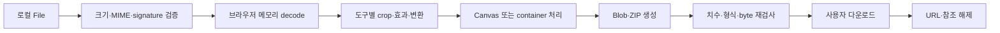

# 픽셀핏 아키텍처

기준일: 2026-07-24

## 1. 상태와 설계 경계

- **공개 v1:** 2026-07-22 배포된 기존 6개 도구 릴리스다.
- **로컬 v2 custom-domain 후보:** 총 13개 도구, 8개 가이드, 중앙 환경설정, Search Console URL-prefix meta와 분리된 AdSense 계정 확인/광고 게이트가 현재 작업 트리에 있다.

이 문서는 v2 후보의 현재 코드 구조를 설명한다. 2026-07-23 RC에서 로컬 lint·typecheck·unit·두 정적 export·E2E·접근성·Lighthouse를 통과했지만, 2026-07-24 SEO·custom-domain 변경의 최종 전체 QA와 GitHub-hosted 공개 배포는 별도다. 공개 v1이나 이전 RC의 `PASS`를 현재 공개 배포 증거로 재사용하지 않는다. 실행 결과는 [STATUS.md](./STATUS.md), 출시 판정은 [RELEASE_CHECKLIST.md](./RELEASE_CHECKLIST.md)에 분리한다.

픽셀핏은 Next.js App Router, React, strict TypeScript와 Tailwind CSS로 만든 static export 앱이다. 이미지 업로드 API, 계정, 사용자 프로젝트 데이터베이스는 없다. 파일 디코드, Canvas 렌더, 형식 변환, ZIP 생성과 다운로드는 브라우저에서 수행한다.

## 2. 계층과 의존 방향

```text
src/app
  route, metadata, static page composition, JSON-LD
       ↓
src/components
  layout, content, ads, session transfer, shared workspaces
       ↓
src/features
  legacy tool adapters + seven v2 tool workspaces
       ↓
src/config
  tools, guides, env, brand URLs, AdSense gates
src/lib
  presets, files, image math/encode/metadata, privacy helpers
       ↓
Browser APIs
  File, Blob, Canvas, createImageBitmap, URL, Worker
```

도구와 가이드 목록은 각각 `src/config/tools.ts`, `src/config/guides.ts`의 Zod 검증 Registry가 단일 탐색 기준이다. 배포 URL과 광고 여부는 `src/config/env.ts`, URL 조립은 `src/config/brand.ts`, 허용 광고 위치는 `src/config/adsense.ts`가 담당한다.

순수 이미지·파일 모듈은 route와 React UI에 의존하지 않는다. 직접 dependency는 v1과 동일하며, v2를 위해 새 runtime·개발 package를 추가하지 않았다.

## 3. 정적 route 모델

빌드 시 생성하는 주요 경로는 다음과 같다.

- 홈 `/`
- 도구 Registry의 `/[tool]` 13개
- 가이드 인덱스 `/guide`
- 가이드 Registry의 `/guide/[slug]` 8개
- `/about`, `/privacy`, `/terms`, `/contact`
- `robots.txt`, `sitemap.xml`, 정적 404

사용자 파일을 받는 route handler, server action, serverless image function은 두지 않는다. 정상 이미지 작업은 클라이언트 경계 안에서 끝난다. static export의 HTML, CSS, JavaScript, 아이콘, OG PNG 같은 자체 자산 요청은 존재하며, 광고를 명시적으로 활성화하면 별도의 외부 광고/CMP 요청이 생길 수 있다.

## 4. Registry와 콘텐츠 모델

### 도구 Registry

각 도구는 최소한 다음을 가진다.

- 고유 `id`, `slug`, `workspaceKind`, 카테고리
- 제목, 짧은 설명, 표시 규격과 검색어
- `official` 또는 `convention` 출처 구분
- 공식값이면 기관, 제목, URL, `lastVerifiedAt`
- 고유 SEO 제목·설명·1200×630 OG PNG·콘텐츠 수정일
- 사용 사례, 출력 설명, 단계, 실수, 한계, 체크리스트, 예시
- 화면용 FAQ와 다음 도구 목록

공식 도구는 출처가 없으면 validation에 실패한다. 자기 자신을 다음 도구로 가리킬 수 없고 slug·연결 대상·OG 파일·가이드 연결은 테스트에서 검사한다. `contentUpdatedAt`은 실제 콘텐츠 버전 날짜이며 출처 확인일이나 파일 촬영일을 대신하지 않는다.

### 가이드 Registry

가이드는 고유 slug, 카테고리, 문제 정의, 검색어, 섹션, 조건 예시 표, 도구 CTA와 관련 가이드를 가진다. 공식 근거가 있는 글은 출처와 확인일을 함께 표시한다. 가이드의 계산·제품 해석은 [PRESET_SOURCES.md](./PRESET_SOURCES.md)와 동일한 경계를 유지한다.

## 5. Workspace 구조

`workspaceKind`가 페이지에서 실제 편집기를 선택한다.

| kind | 담당 도구 | 구현 경계 |
| --- | --- | --- |
| `photo` | 여권, 일반 증명, 주민등록증, YouTube 배너 | 기존 `PhotoWorkspace`, 프리셋 정책과 크롭/출력 검사 |
| `favicon` | 파비콘 | 다중 PNG·ICO·manifest·ZIP 생성 |
| `privacy` | 개인정보 정리 | 형식별 메타데이터 parser와 결과 재검사 |
| `compressor` | 사진 용량 줄이기 | 목표 byte, 제한된 품질 탐색, 선택적 최대 4회 축소 |
| `resizer` | 이미지 크기 변경 | 치수·긴 변·퍼센트, 비율 잠금, contain/cover |
| `converter` | 형식 변환 | JPEG/PNG/WebP, 품질·배경·투명도 정책 |
| `social-pack` | SNS 이미지 팩 | 1:1·4:5·9:16 독립 crop, 개별/ZIP 출력 |
| `youtube-thumbnail` | YouTube 썸네일 | 3840×2160 16:9 템플릿 |
| `four-cut` | 네컷사진 | 1~4개 파일, 반복 슬롯, 레이아웃·프레임·문구 |
| `film` | 필름사진 | 결정적 픽셀 효과와 원본 비교 |

공통 utility 도구는 `UtilityWorkspace`와 `useUtilityImage`, 창작 도구는 shared creative workspace와 `useCreativeImages`를 재사용한다. UI가 표시됐다는 사실만으로 기능 완료를 선언하지 않고 생성 Blob 또는 ZIP을 다시 읽어 도구 계약을 확인해야 한다.

## 6. 공통 이미지 파이프라인



확장자만 신뢰하지 않고 MIME과 signature를 조합한다. 디코드 전에 byte·예상 픽셀 한도를 적용하며, 미리보기는 긴 변 1280px·120만 픽셀 이하로 제한하고 최종 출력 해상도와 분리한다. 크롭 좌표는 원본 기준으로 유지하고 늦게 도착한 분석 결과가 사용자의 편집을 덮지 않게 한다.

필름·네컷 톤·압축·리사이즈·형식 변환은 지원 브라우저에서 `Worker`, `OffscreenCanvas`, `createImageBitmap`을 사용한다. 작업 완료·취소 시 bitmap과 Worker를 닫고, 지원하지 않는 환경에서는 같은 출력 계약을 가진 Canvas 폴백으로 전환한다. 폴백의 긴 동기 픽셀 루프는 실행 도중 즉시 중단하지 못하고 전후에만 취소를 확인할 수 있다.

JPEG/WebP 품질 탐색은 종료 횟수가 제한된다. 목표를 만족하지 못하면 무한 반복하거나 가짜 성공을 표시하지 않는다. Canvas 인코더와 브라우저 색상 관리 때문에 원본 픽셀·ICC·메타데이터가 그대로 보존된다고 일반화하지 않는다.

## 7. 공식 도구 정책 게이트

프리셋 Registry는 출력 규격, 허용 작업, 금지 작업, 면책과 출처를 검증한다. UI에 버튼을 숨기는 것만으로 끝내지 않고 실행 경계에서 작업 allowlist를 다시 확인한다.

- 여권사진은 크롭·회전·리사이즈·제한적 압축만 허용하고 배경 제거·교체, retouch, 생성형 작업을 차단한다.
- 3×4cm와 3.5×4.5cm의 픽셀값은 `round(cm / 2.54 × 300)` 서비스 환산값이다. 기관이 명시한 온라인 픽셀값으로 과장하지 않는다.
- 얼굴 자동 맞춤은 선택적 네이티브 `FaceDetector`의 일시적 bbox만 사용한다. 미지원·0명·다중·실패 시 수동 경로를 제공하며 외부 모델로 대체하지 않는다.
- 배경 분리는 일반 증명사진의 명시적 경로에서만 로컬 결정적 색상 계산을 사용한다. 품질이 낮으면 원본 배경으로 돌아갈 수 있다.

## 8. 신규 도구의 계산 경계

- 압축기는 목표를 상한으로 취급하고 실제 `Blob.size`를 검사한다. 최소 품질 또는 축소 한계에서도 넘으면 미달을 알린다.
- 리사이저는 contain과 cover를 구분하고 원본보다 큰 출력에는 업스케일 경고를 표시한다.
- 변환기는 JPEG/PNG/WebP만 지원한다. 투명 입력을 JPEG로 만들 때 선택 배경에 합성하며 HEIC을 처리했다고 표시하지 않는다.
- SNS 팩은 출력 비율별 crop을 독립적으로 보존한다. 원형 미리보기는 표시 보조이며 파일 규격 자체가 원형 이미지라는 뜻은 아니다.
- YouTube 썸네일은 최신 공식 권장 3840×2160을 사용한다. 템플릿은 제한형 편집이며 YouTube 노출·CTR을 보장하지 않는다.
- 네컷사진은 입력이 4장보다 적으면 사용자가 고른 사진을 슬롯에 반복한다. 자동으로 새 인물이나 장면을 생성하지 않는다.
- 필름 효과는 동일 설정과 seed에서 재현 가능한 로컬 픽셀 계산이다. 생성형 AI, 원격 모델, 실제 필름 현상 재현 보장을 사용하지 않는다.

## 9. 같은 사진으로 다음 도구

사용자가 결과 화면에서 명시적으로 다음 도구를 선택할 때만 현재 `File`을 `ImageTransferProvider`에 넘긴다.

1. Provider는 `File` 하나를 React `useRef`에 보관한다.
2. 대상 도구 ID를 함께 기록한다.
3. 대상 편집기가 한 번 `claim`하면 참조를 제거한다.
4. 대상이 다르거나 다시 claim하면 전달하지 않는다.
5. 새로고침·탭 종료 시 브라우저 메모리와 함께 사라진다.

이 경로는 파일 복제나 업로드가 아니며 localStorage, sessionStorage, IndexedDB, Cache Storage를 사용하지 않는다. 사용자의 클릭 없이 자동으로 다른 도구에 파일을 전달하지 않는다.

## 10. 중앙 환경설정과 URL

`parseEnvironment`는 URL, base path, 사용자 정의 도메인, 연락처, 운영자명, 광고 값, Google Search Console과 Naver 확인 토큰을 검증한다. 잘못된 선택값은 경고 후 사용하지 않으며, 핵심 URL과 custom hostname은 잘못되면 빌드를 실패시킨다.

- project Pages: `siteUrl=https://dubeeubbee.github.io/pixelfit`, `basePath=/pixelfit`
- custom root: `CUSTOM_DOMAIN`의 HTTPS origin을 canonical로 사용하고 base path를 빈 값으로 강제
- 페이지 URL은 trailing slash를 통일하고 파일 URL은 확장자 뒤 slash를 붙이지 않음
- canonical, OG, sitemap, robots, 내부 링크와 JSON-LD가 같은 helper를 사용

custom root와 `/pixelfit`은 별도 빌드·검사 대상이다. GitHub Pages의 도메인 Settings, DNS, TLS와 Actions가 `CNAME`을 무시하는 동작은 코드 밖 운영 경계다.

## 11. 광고 게이트

AdSense 광고 제공은 기본 비활성이다. 다음 조건이 모두 참일 때만 전역 광고 스크립트와 슬롯을 렌더링한다.

1. `ADSENSE_ENABLED=true`
2. client가 `ca-pub-`와 16자리 숫자 형식
3. content slot이 10자리 숫자 형식
4. 위치가 `home-content-break`, `guide-content-break`, `tool-explainer-end` 중 하나

업로드, 편집, 미리보기, 결과, 다운로드, 내비게이션, privacy, terms, contact 표면은 금지한다. 설정이 꺼졌거나 불완전하면 광고 DOM과 네트워크 스크립트 모두 생성하지 않는다.

계정 확인 표면과 광고 제공은 별도다. 실제 형식의 publisher client가 있으면 광고 enabled/slot과 무관하게 `google-adsense-account` meta를 만들고, custom domain build에서는 루트 `ads.txt`를 만든다. 이 두 표면은 계정 연결을 도울 뿐 광고 요청, 사이트 승인 또는 동의 준수를 뜻하지 않는다. CMP, 계정·사이트 승인과 지역별 동의 정책은 외부 운영 작업이다.

기존 `pixelfit.o-r.kr`은 Public Suffix List에 등록된 플랫폼 하위 도메인이 아니라 `o-r.kr` 아래 일반 하위 도메인이며 상위 `o-r.kr/ads.txt`도 이 프로젝트가 제어하지 못해 AdSense 사이트 등록 계약을 충족하지 못했다. 새 production 후보 `pixelfit.me`는 registrable root 형식이지만, 공개 root `ads.txt`, AdSense 사이트 수락, CMP와 승인이 실제 확인되기 전에는 광고 제공을 OFF로 유지한다.

## 12. SEO와 구조화 데이터

- 홈: `WebSite`
- 가이드 허브: `ItemList`
- 도구: `BreadcrumbList`
- 가이드 상세: `BreadcrumbList`, `Article`
- 모든 주요 공유 이미지: 자체 생성 1200×630 PNG
- Google Search Console verification: 유효한 build-time token이 있을 때 URL-prefix HTML 확인 meta 생성
- Naver verification: 유효한 build-time token이 있을 때만 meta 생성

화면용 FAQ는 콘텐츠로 유지하지만 `FAQPage` JSON-LD는 생성하지 않는다. 실제 price, review 또는 rating 근거가 없으므로 `WebApplication`/`SoftwareApplication` rich-result 표시는 만들지 않는다. 가짜 review, rating, 사용량, 존재하지 않는 작성·수정 날짜를 만들지 않는다. Google Search Console token은 HTML 확인 수단만 제공하며 속성 등록, 소유권 확인과 sitemap 제출은 별도 외부 검증이다.

## 13. 메타데이터·개인정보

개인정보 정리는 JPEG/PNG/WebP의 알려진 개인정보성 필드를 선택적으로 제거하고 결과를 다시 파싱한다. 지원 경로에서는 압축 픽셀 payload 보존을 우선하지만 알려지지 않은 vendor metadata나 콘텐츠 자격 증명 유효성까지 보장하지 않는다. C2PA/JUMBF/Content Credentials는 제거 선택지로 제공하지 않는다.

HEIC 디코더는 번들하지 않는다. HEIC 또는 미지원 container에 대해 가짜 결과·가짜 메타데이터·보존 성공을 만들지 않는다. 세부 데이터 생명주기와 광고 네트워크 경계는 [PRIVACY_MODEL.md](./PRIVACY_MODEL.md)를 따른다.

## 14. 빌드와 배포 경계

`next.config.ts`의 `output: "export"`로 `out/`을 만든다. `next start`나 이미지 처리 서버를 사용하지 않는다. `pnpm build`는 `pixelfit.me` production 후보 root 계약, `pnpm build:pages`는 `/pixelfit` 회귀 계약, `pnpm build:custom:test`는 test-only root-domain 계약을 빌드한다. `scripts/verify-static-export.mjs`는 route·canonical·asset·OG·CNAME·검증 meta·광고 비활성 상태를 검사한다.

Next.js 16 기본 Turbopack은 현재 Worker 모듈 그래프에서 빌드가 끝나지 않아 release script는 `next build --webpack`을 사용한다. Webpack은 Worker runtime chunk 사이의 circular-dependency 경고를 출력하지만 정적 export와 브라우저 검사는 통과했다. 이는 제거되지 않은 알려진 build 경고이며 [STATUS.md](./STATUS.md)에 기록한다.

로컬 RC는 다음을 서로 독립적으로 확인한다.

- project Pages `/pixelfit` build 계약
- custom-domain root build 계약
- Registry의 13개 도구·8개 가이드 route
- E2E, 개인정보 네트워크 검사, 접근성, Lighthouse

공개 release에는 여기에 실제 GitHub Actions, 공개 URL, 404·새로고침·MIME·응답 헤더 검증을 추가한다.

실행하지 않은 항목은 `NOT_TESTED`다. 로컬 정적 export가 성공해도 DNS, TLS, Search Console, Naver, AdSense, CMP 또는 공개 배포 완료로 확대하지 않는다. 기존 `pixelfit.o-r.kr`의 2026-07-25 공개 HTTPS·Search Console 성공은 새 `pixelfit.me`의 상태를 증명하지 않는다.
